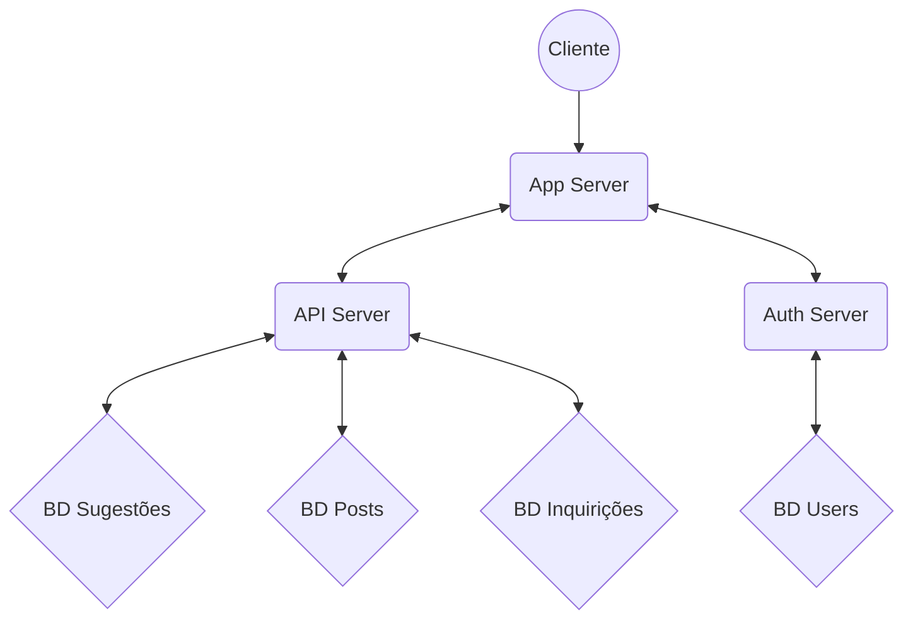

# Relatório: Aplicação Web

Autores:
- A97503 - Dinis Gonçalves Estrada 
- A95114 - Emanuel Lopes Monteiro da Silva

## 1. Introdução

No âmbito da unidade curricular de Engenharia Web foi nos proposto a elaboração de uma aplicação web.

Para a realização deste projeto utilizaram-se três servidores, sendo que o primeiro estaria encarregue da aplicação, o segundo estaria encarregue pela a autenticação dos utilizadores, que utiliza os Json Web Tokens (JWT) e o terceiro seria uma API para que fosse possível fazer a comunicação com a MongoDB. Todos estes servidores foram feitos utilizando a framework Express que é uma framework popular de aplicação web de Node.js

O tema escolhido pelo grupo foi relativo às Inquirições de Génere.

Para que tal possa ser bem sucedido, o grupo teve de aplicar o conhecimento adquirido ao longo das várias aulas práticas e teóricas.

A aplicação Web concebida compreende as seguintes funcionalidades: 
- Login (Users/Admins) 
- Registo/Modificação/Eliminação de Perfil (Admins) 
- Consulta de Posts (Users/Admins) 
- Consulta de Registos (Users/Admins) 
- Criação de Posts (Users/Admins) 
- Criação/Modificação de Registos (Admins) 
- Consulta Perfil (Users/Admins) 
- Criação/Eliminação de Comentários sobre Posts (Users/Admins)
- Criação/Eliminação de Sugestões (Users/Admins)
  

## 2. Arquitetura Aplicacional

Os três servidores estão projetados para trabalhar juntos para criar um aplicativo da Web totalmente funcional. Eles podem ser hospedados em servidores separados ou combinados em uma única implantação través de do uso de vários terminais para inicializar o serviço através do comando "npm i" para instakar as dependências e  "npm start" para inicializar os serviços ou então podemos inicializar com recurso ao docker-compose. Temos uma  visão geral de como os servidores se integram:

1. O cliente interage com o servidor App enviando solicitações HTTP para rotas específicas.

2. O servidor App lida com essas solicitações e renderiza exibições HTML dinâmicas usando modelos Pug.

3. O cliente pode autenticar enviando uma solicitação para os terminais de autenticação do Servidor de autenticação através do Servidor App.

4. O servidor de autenticação valida as credenciais do usuário, gera um token JWT após a autenticação bem-sucedida e envia-o de volta ao cliente através do servidor app.

5. O cliente inclui o token JWT em solicitações subsequentes para acessar rotas protegidas.

6. O servidor API recebe essas solicitações, valida o token JWT e executa as operações de banco de dados solicitadas usando o MongoDB.

7. O servidor API envia de volta as respostas apropriadas ao cliente, indicando o sucesso ou a falha da solicitação da API

## 3. Processamento de Dados 
Para tratar do dataset que nos foi atríbuido neste trabalho começamos em primeiro por identificar o id de um registo, que no CSV original estava identificado por "ID" e passado o nome deste campo para "_id" para assim o mongodb identificar este campo como o id. Relativamente às ligações/relações entre registos usamos os campos, "ScopeContent" e "RelatedMaterial", em que no "ScopeContent", usando expressões regulares, retiramos o primeiro nome da Filiação e materializamos numa relação, indo buscar o id do registo que contesse o tal nome no campo "UnitTitle" e adicionando a uma lista de dicionários, que é um novo campo de um registo denominado por "Filiacao", em que para cada um a chave "Title" corresponde ao nome e o "Id" corresponde ao "_id" do registo. O processo é semelhante para o "RelatedMaterial", usando expressões regulares foi se buscar o "UnitId", ignorando os 0's iniciais, e a partir desse extraiu se o nome e o "_id" do registo correspondente e criou-se um novo dicionário adicionando o à "Filiacao".

## 4. Utilizadores e permissões
Neste projeto, tal como solicitado, os diferentes níveis dos utilizadores refletem-se em diferentes funcionalidades às quais cada um tem acesso.

### 4.1 Administrador
O Administrador é o nível mais alto de acesso que um utilizador pode ter. Consequentemente, tem acesso a todas as funcionalidades existentes.

### 4.2 Utilizador
O Utilizador é o nível mais baixo e o tipo de utilizador que tem menos acesso na aplicação desenvolvida

## 5. Servidor da Aplicação:
Este servidor foi desenvolvido com recurso ao Node.js e à framework Express. Este fica à escuta na porta 8000 e é o principal serviço da aplicação desenvolvida. E este servidor que responde a todos os pedidos de visualização de qualquer utilizador, desde que tenha acesso a tais recursos, e que serve de intermediário com os restantes servidores.

O servidor da aplicação é responsável por carregar as páginas para que o utilizador possa interagir. Estas páginas foram todas criadas utilizando a linguagem Pug. Pug foi escolhido para gerar as interfaces porque é uma linguagem que permite uma geração dinâmica e reutilizável de HTML. Como já foi mencionado acima o servidor foi construído utilizando a framework Express e por isso suporta a recessão de pedidos de várias rotas. As respostas a estes pedidos são páginas Pug que são enviadas para o cliente
  

## 6. Servidor de Autenticação: JWT
Este servidor foi desenvolvido com recurso ao Node.js e à framework Express. Este fica à escuta na porta 8002, e responde aos pedidos relacionados com a gestão de utilizadores, as suas informações e os seus json web tokens, cruciais para aceder às rotas protegidas.
Para todo o processo de autenticação utilizamos os módulos passport, passport-local, session e jsonwebtoken. Antes de cada pedido, no ficheiro app.js, definimos que iria ser utilizada uma sessão, com a secret EngWeb2023. Posteriormente definimos a estratégia local, implementamos a serialização e desserialização do utilizador, e por fim inicializámos as funcionalidades do módulo passport. No roteador, utilizámos uma função para verificar o token em todos os pedidos que necessitassem de autenticação. No login ocorre um caso especial visto que utilizamos a estratégia local para validar as credenciais e só depois disso é que geramos o json web token, com a validade de 1 hora.

  

## 7. Servidor da API: Comunicação com MongoDB
Este servidor foi desenvolvido com recurso ao Node.js e à framework Express. Este fica à escuta na porta 8001, e responde com os metadados dos recursos armazenados.
Este servidor é responsável pela comunicação com a MongoDB que é uma base de dados NoSQL (não relacional) bastante popular. Este servidor comunica com o server de aplicação através do JWT para que a informação seja fornecida de forma segura. Esta informação trata-se de pedidos gerados pela aplicação que pode ser o armazenamento, leitura ou edição de dados.

### 7.1 Modelos 
Para persistir os dados e metadados da nossa aplicação, decidimos recorrer ao módulo mongoose. Foram criados 3 schemas: um para os comentários, um para as notícias e outro para os metadados dos recursos. Com isto é possível estabelecer a conexão com uma base de dados em MongoDB, denominada Project. Os schemas criados permitem-nos ter diversas coleções nessa base de dados e trabalhar sobre as mesmas. As coleções finais criadas através destes schemas são: posts, insquirições e sugestões. 

## 8. Conclusão

Através do desenvolvimento deste projeto pudemos aplicar os conhecimentos adquiridos

nas aulas, e aprofundar a nossa compreensão do modo

de funcionamento da framework Express, da utilização dos JWT e de Pug.

Reconhecemos que existem alguns aspetos que podiam vir a ser melhorados no projeto mais concretamente a parte de segurança dos dados. Consideramos que desenvolvemos um bom trabalho, que implementa todas as funcionalidades exigidas.

## Anexos

### Manual de Utilização

Para simplificar o arranque da aplicação, composta por vários serviços que precisam de interagir entre si, foi utilizado o Docker Compose. Através da definição das configurações no ficheiro  `docker-compose.yml`, o Docker Compose cria e inicia automaticamente todos os containers necessários, configurando também a comunicação entre eles. Para simplificar a importação dos dados, foi criado um script para criar a base de dados e as suas coleções, efetuando o respetivo povoamento da mesma.

1.  Clone o repositório para a sua máquina e mova-se para a pasta do projeto:

`git clone https://github.com/EmanuelsGiT/ENGWEB2023-Projeto.git`
`cd ENGWEB2023-Projeto/src`

2.  Utilize o script `data_process.py` para formatar corretamente as inquirições para a pasta. Basta apenas executar `python data_process.py` que se encontra nas patas src

3.  Mova-se para a pasta  `data`:

`cd data`

4.  Conceda permissões ao script:
 
`chmod +x import.sh`

5.  Execute o script:

`./import.sh`

6.  A aplicação deverá estar disponível em:  [localhost:8000/](https://localhost:8000/)

#### Utilizar o docker-compose

1.  Verifique se o Docker e o Docker Compose estão instalados.
2.  Na pasta do projeto, construa e inicie os containers para correr o projeto:
  
Para correr em modo detached (segundo plano):

`docker-compose up -d --build`

Para ter acesso aos logs (primeiro plano):

`docker-compose up --build`

3.  É necessário entrar dentro do container mongodb para importar manualmente os ficheiro json.
utilize `docker ps` para verificar o id do container
execute o comando `docker exec -it containerId bash` para entrar dentro do container
executar o seguinte comando:
`mongoimport --db Project --collection users --file /data/db/users.json --jsonArray && mongoimport --db Project --collection inquiricoes --file /data/db/inquiricoes.json --jsonArray && mongoimport --db Project --collection posts --file /data/db/posts.json --jsonArray && mongoimport --db Project --collection sugestoes --file /data/db/sugestoes.json --jsonArray`